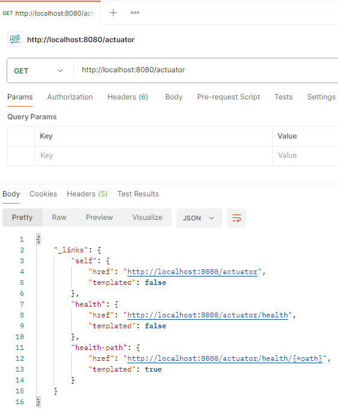

#Starter Files and link to repo for Advanced Spring Boot Actuator Course 3010189
#Link to repo https://github.com/MikailaAkeredolu/spring-boot-actuator-video

#Link to Aktuator Endpoints:  http://localhost:8080/actuator 

in Postman: 

Spring Documentation for available endpoints: https://docs.spring.io/spring-boot/docs/current/reference/html/actuator.html

e.g. http://localhost:8080/actuator/health

